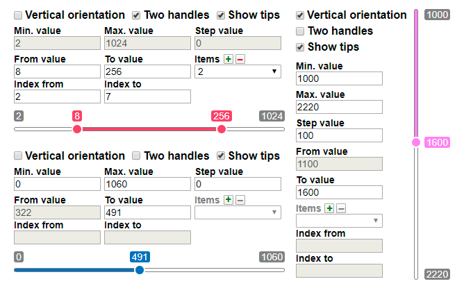
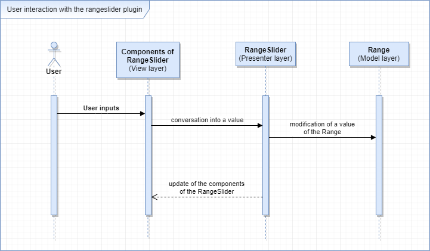
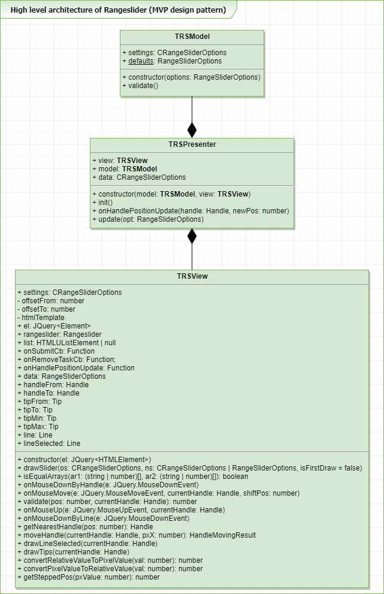
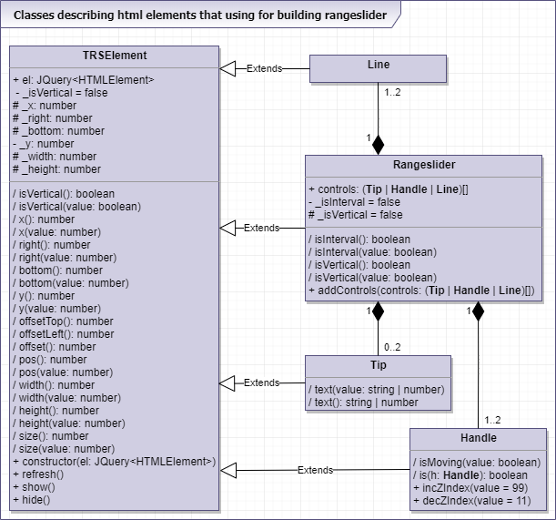
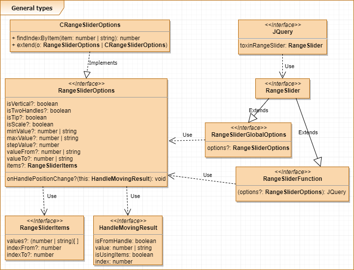

# ToxinRangeSlider
[](https://github.com/facebook/jest)       
**ToxinRangeSlider** - this is jquery plugin that allows you to select a value or range of values. This is pet project, that being part of [FSD](https://www.fullstack-development.com) education program (task №4). 

> Read more about of education program follow this link: www.fullstack-development.com/#system

> Read more about  of frontend education program tasks follow this link: [rizzoma.com](https://rizzoma.com/topic/d5c429337bcaa70548fb5aeedee6d92b)

## Technical details
 1. Project bundler: [Webpack](https://webpack.js.org)
 2. Package manager: [Yarn](https://yarnpkg.com)
 3. HTML template engine: [PUG](https://pugjs.org)
 4. CSS preprocessor: [LESS](http://lesscss.org)
 5. Javascript transpiler: [Typescript](https://www.typescriptlang.org/index.html)
 6. Used [Jquery](https://www.npmjs.com/package/jquery)
 7. Browser support: Chrome and Firefox - two last version (specified in package.json)
    > **npx browserslist** - run this command  in project directory to see what browsers was selected

    > **npx browserslist --coverage** - check coverage for selected browsers
## Watch result on github.io
   + [Demo with 10 rangesliders](https://wirwl.github.io/PetProjects/FSD/ToxinRangeSlider/index.html)

|  |
| :--: | 

## How to use plugin
Add style and script files to html code:
```html
<html>
  <head>        
    <link href="jquery-plugins/toxin-rangeslider/toxin-rangeslider.css" rel="stylesheet">
      <body>
        <script type="text/javascript" src="jquery-plugins/toxin-rangeslider/toxin-rangeslider.js"></script>
      </body>
  </head>
</html>
```
Rangeslider will automatically initialize on elements with class **.toxin-rangeslider-here**. You can use any html tags that can have content, for example *div*. Setting options possible with data attribute *data-options*
```html
<div class="toxin-rangeslider-here" data-options="{"isVertical":true,"isTwoHandles":true,"isTip":true,"minValue":1000,"maxValue":2220,"stepValue":100,"valueFrom":1100,"valueTo":1600}"></div>
```
Manual initialization in javascript code
```javascript
$('#my-element').toxinRangeSlider({options})
// Access instance of plugin
$('#my-element').data('toxinRangeSlider')
```

## Options
| Option        | Type          | Defaults      | Description
| ------------- | ------------- | ------------- | -----------
| isVertical    | boolean       | false         | Set slider position - vertical or horizontal.
| isTwoHandles  | boolean       | true          | Set slider handles count - one or two.
| isTip         | boolean       | true          | Enable tips.
| minValue      | number        | 0             | Set slider minimum value
| maxValue      | number        | 1000          | Set slider maximum value
| stepValue     | number        | 0             | Set slider step. Actual if value is bigger than 0            |
| valueFrom     | number        | 0             | Set start position for left handle. Not used if *isTwoHandles* set to *false*
| valueTo       | number        | 1000          | Set start position for right handle. Also used if only one handle (*isTwoHandles* set to *true*)
| items         | object*       | null          | Complex object for define items in slider.


*Complex object with next fieds: 
{indexFrom: number, indexFrom: number, indexTo: number, values: (number | string)[] }
| Option       | Description
| ------------ | -----------
| indexFrom    | Set slider position - vertical or horizontal.
| indexTo      | Set slider handles count - one or two.
| values       | Enable tips.

## Description of plugin architecture in [UML](https://www.omg.org/spec/UML) notation





## Some usefull commands
  >**git clone https://github.com/wirwl/toxinhotel.git** - copy project from remote repository to local computer

  >**yarn install** - install all dependencies

  >**yarn clr** - clear output folder (remove all files and directories)

  >**yarn clr:dev** - clear output folder (remove all files and directories in dev folder)

  >**yarn clr:prod** - clear output folder (remove all files and directories in prod folder)

  >**yarn dev** - build project with development mode

  >**yarn prod** - build project with production mode

  >**yarn test** - run all tests

  >**yarn le** - run index.html with [webpack-dev-server](https://www.npmjs.com/package/webpack-dev-server) for editing with live reloading


