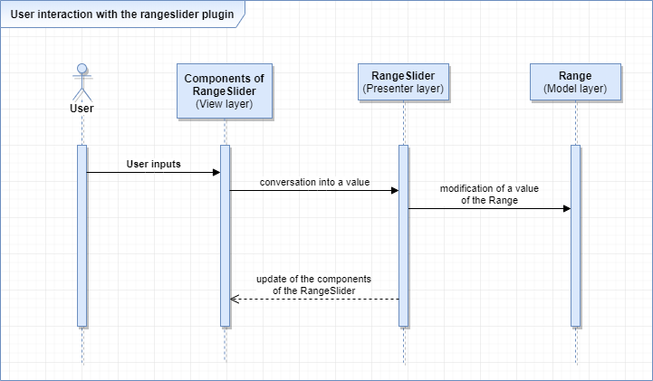

# ToxinRangeSlider
       
**ToxinRangeSlider** - this is jquery plugin that allows you to select a value or range of values. This is pet project, that being part of [FSD](https://www.fullstack-development.com) education program (task №4). 

> Read more about of education program follow this link: www.fullstack-development.com/#system

> Read more about  of frontend education program tasks follow this link: [rizzoma.com](https://rizzoma.com/topic/d5c429337bcaa70548fb5aeedee6d92b)

## Technical details 
 1. Project bundler: [Webpack](https://webpack.js.org)
 2. Package manager: [Yarn](https://yarnpkg.com)
 3. HTML template engine: [PUG](https://pugjs.org)
 4. CSS preprocessor: [LESS](http://lesscss.org)
 5. Javascript transpiler: [Typescript](https://www.typescriptlang.org/index.html)
 6. Used [Jquery](https://www.npmjs.com/package/jquery)
 7. Browser support: Chrome and Firefox - two last version (specified in package.json)
    > **npx browserslist** - run this command  in project directory to see what browsers was selected

    > **npx browserslist --coverage** - check coverage for selected browsers
## Watch result on github.io
   + [Demo with 10 rangesliders](https://wirwl.github.io/PetProjects/FSD/ToxinRangeSlider/index.html)

## Description of plugin architecture in [UML](https://www.omg.org/spec/UML) notation

## Some usefull commands
  >**git clone https://github.com/wirwl/toxinhotel.git** - copy project from remote repository to local computer

  >**npm install** - install all dependencies

  >**npm run clr** - clear output folder (remove all files and directories)

  >**npm run clr:dev** - clear output folder (remove all files and directories in dev folder)

  >**npm run clr:prod** - clear output folder (remove all files and directories in prod folder)

  >**npm run dev** - build project with development mode

  >**npm run prod** - build project with production mode

  >**npm run le** - run index.html with [webpack-dev-server](https://www.npmjs.com/package/webpack-dev-server) for editing with live reloading

  >**npm-check --skip-unused** - check what packages is out of date with [npm-check](https://www.npmjs.com/package/npm-check)

Recalculates onresize so suitable for use within responsive designs

  

